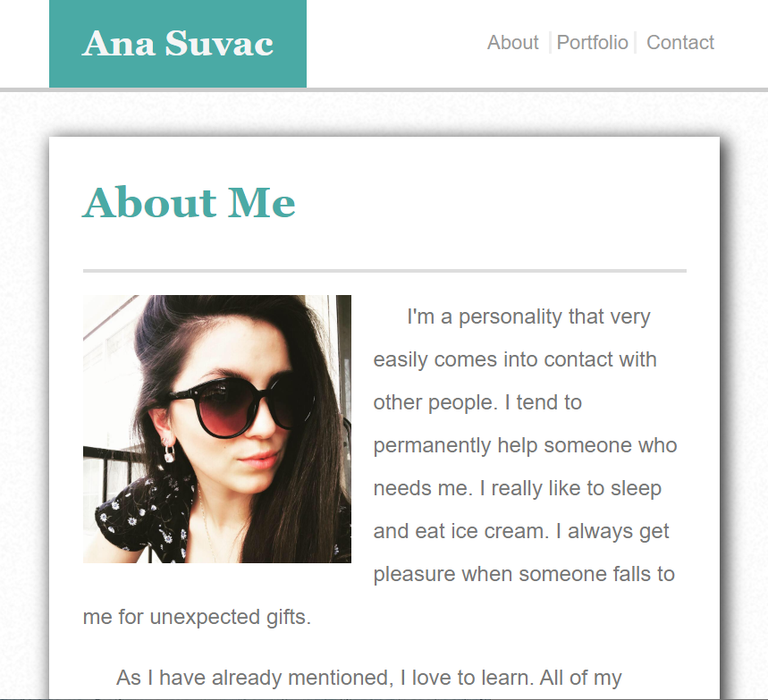

For this project I have created 3 separate pages that make up my portfolio. It includes 3 links at the top of the page that will take you to each page. The first page is an "About Me" page that includes an image and description of who I am. The second page is the actual "Portfolio" page. This page includes links to all of my work. The last page is a "Contact" page. It connects you to me through filling out a form with your name and email.

You will need to have internet access and this link (https://ana199816.github.io/homework-02/) to view the page. Once there you can navigate the site using the three tabs at the top "About, Portfolio and Contact." You can interact with the portfolio page by clicking on the items as the scroll or manually scroll the items using the right and left arrows.

Screenshots: https://github.com/Ana199816/homework-02/tree/master/assets/images

Built With:

Visual Code Studio 

Credits: getbootstrap.com

MIT License:

Copyright (c)

